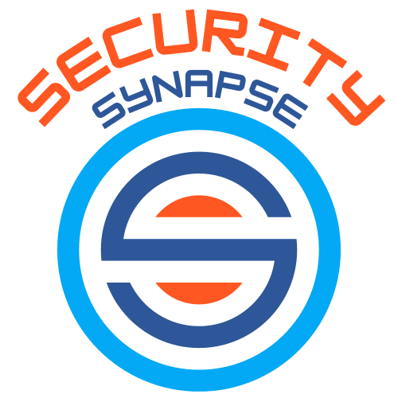

{fig-align="center"}

## Adventure in Computer Security

With the goal of enabling the growth of computer security engineers, this web
site features a sixteen-week schedule filled with activities that support the
development of your professional and technical capacities in the field of
computer security. One of the primary goals of this course is to create a
*security synapse* by connecting high-level concepts (e.g., authentication,
authorization, and cryptography) in the field of computer security with their
implementation in programming languages such as Python, Java, C, Go, and Rust.
Along with leveraging research papers and popular-press articles, this course
references four open-access books: [Computer Systems Security: Planning for
Success](https://web.njit.edu/~rt494/security/), [Cracking Codes with
Python](https://inventwithpython.com/cracking/), [The Joy of
Cryptography](https://joyofcryptography.com/), and [Operating Systems: Three
Easy Pieces](https://pages.cs.wisc.edu/~remzi/OSTEP/). You can access all of
the source code and technical content for this course by checking out its
[GitHub organization](https://github.com/SecuritySynapse),
[schedule](schedule/index.qmd), and [slides](slides/index.qmd).

## Resources for Making a Security Synapse

Interested in getting started on a computer security adventure? Begin here:

- The [course syllabus](./syllabus/index.qmd) introduces the course and its
learning objectives, overviews the security survey and security summit projects,
and explains how on-campus learners will be assessed by the instructor through,
for instance, examinations, project demonstrations, and in-person evaluations.

- The [sixteen-week course schedule](./schedule/index.qmd) offers detailed
insights into each step that learners should take to help them to effectively
make security synapses, including a list of reading assignments, descriptions of
the class activities and projects, and references to external resources in
computer security.

- The [course slides](slides/index.qmd) are a valuable resource for learners who
want to make a security synapse. These slides present an overview of high-level
concepts and provide both more detailed explanations and implementations in
various programming languages, with a focus on content in Python.

- The [course projects](projects/index.qmd) page furnishes descriptions of
each two-week project that learners complete to ensure that they have suitable
hands-on practice to make a security synapse and achieve the learning objectives
for the course. The project list also includes details about the long-term
computer security summit project that invites learners to propose, conduct, and
report on an independent research project. Each project invites a learner to (a)
understand fundamental concepts in computer security, (b), implement those
concepts into a working prototype, (c) evaluate the prototype through well-designed
experiments, (d) give a demonstration of the prototype to both the course
instructor and their peers, and (e) give a presentation to document their
learning adventure!

## Connecting Concepts to Code

Do you wonder how to practically apply the concepts you are learning about,
say, cryptography? As you browse the technical resources on this site you will
notice that they often contain both Python source code and the output from
running code.

```{python}
from cryptography.fernet import Fernet
import json

def encrypt_file(file_path: str, key: str):
    """Encrypt a file using a symmetric key."""
    # load the file
    with open(file_path, 'r') as file:
        data = json.load(file)
    # convert the dictionary into a string
    data_string = json.dumps(data, sort_keys=True)
    # create a Fernet object
    fernet = Fernet(key)
    # encrypt and return the data
    encrypted_data = fernet.encrypt(data_string.encode())
    return encrypted_data

# generate a symmetric key
key = Fernet.generate_key()
# encrypt the file and display it
encrypted_data = encrypt_file('slides/weektwo/security.json', key)
print(encrypted_data)
```

The prior source code segment demonstrates how to use the `Fernet` symmetric key
encryption algorithm to encrypt a JSON file. The output of this code is the
encrypted file that can only be decrypted using the same symmetric key. Notably,
this output was produced by automatically running the `encrypt_file` function
when this site was deployed! If you check the [course slides](slides/index.qmd)
you can see many other Python source code segments --- including some that you
can modify and run through an editor in the slide! Remember, whenever you see a
source code segment in one programming language, like the one for the
`encrypt_file` that was implemented in Python, please think about how you might
build it in another language and what trade-offs you might make. As you emerge
as a computer security engineer, make sure to train yourself to think about
the usability and security trade-offs in programming languages, operating
systems, computer architectures, networking protocols, and software applications!

## Selected Slide Decks

Focused on presenting an overview of high-level technical concepts and a
thorough investigation of their low-level technical implementation, the
[course slides](slides/index.qmd) are a valuable resource for learners who
want to make a security synapse. The slides are designed to be interactive,
allowing learners to see the output of code segments and, for many algorithms,
modify their inputs and/or experiment with their implementation. Although many
implementations are in Python, there are pointers to projects in many different
programming languages. Want to learn more? Here are quick references to some
selected presentation slide decks:

:::{#featured-slides}
:::

::: {.callout-note appearance="minimal" title="Security Synapse Community Resources"}

Interested in connecting with other like-minded computer security engineers?
Please join the [Security Synapse Discord
Server](https://discord.gg/juUXz7d4Jh) and join the conversation! If you are an
on-campus learning at Allegheny College, you may also join the [Allegheny
College Computer Science Discord Server](https://discord.gg/CS2h9kXzX6).
Finally, if you are an on-campus learner, then you may schedule and attend a
meeting with the course instructor during office hours by visiting the [Course
Instructor's Appointment
Scheduler](https://www.gregorykapfhammer.com/schedule/).

:::
